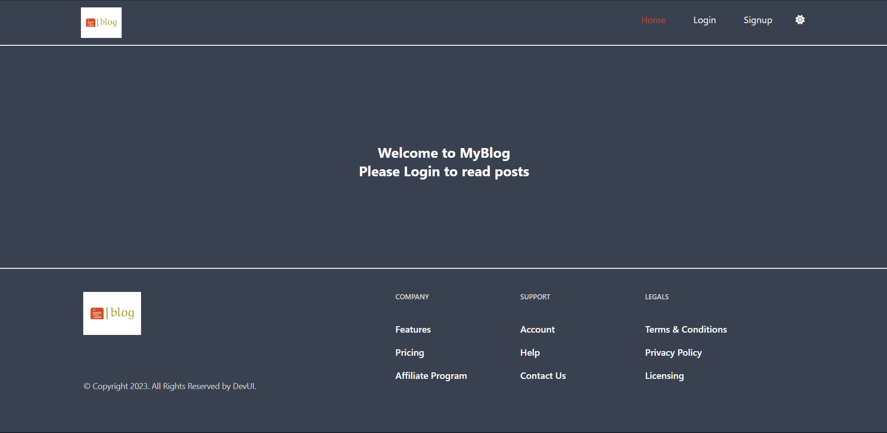
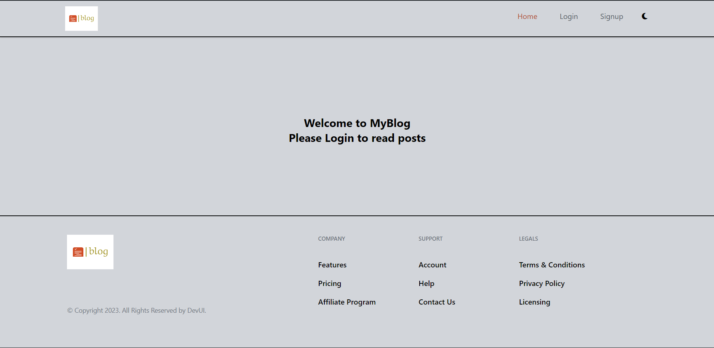
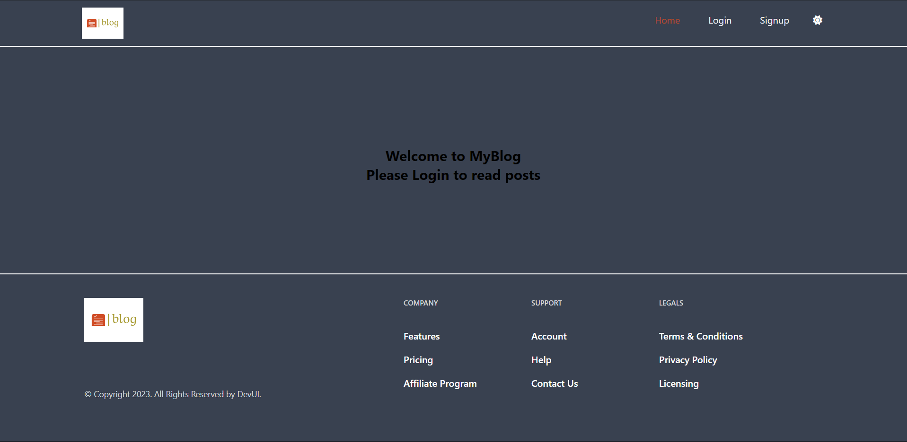
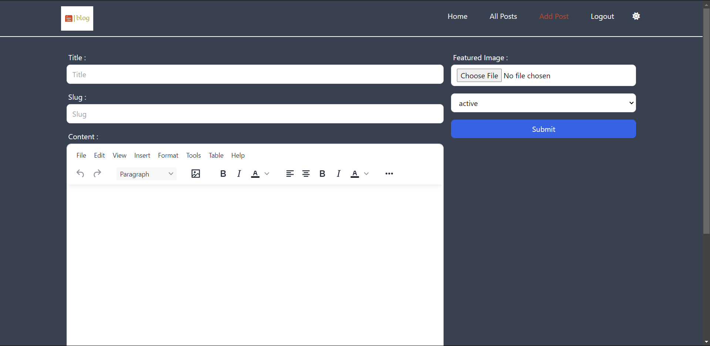
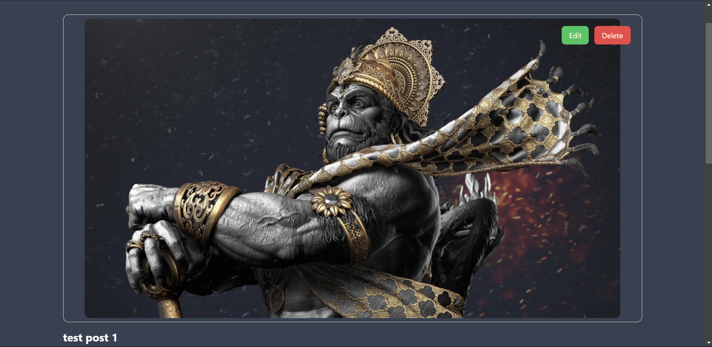
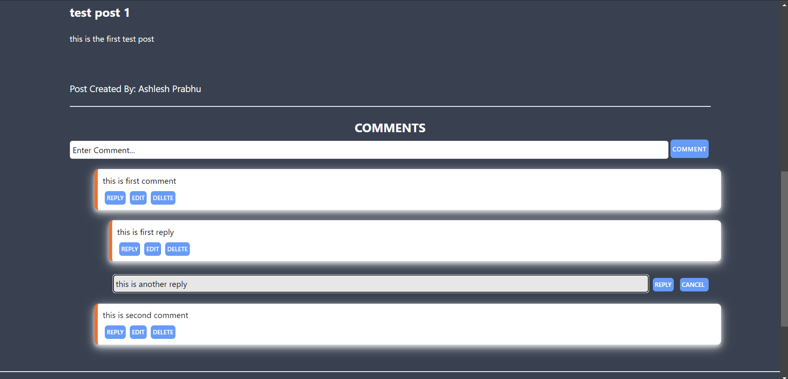
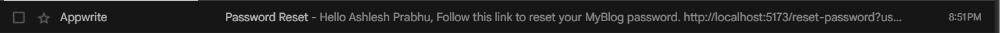

# Blog Website

This is a blog website built using React, Tailwind CSS, and Appwrite as a Backend-as-a-Service (BaaS). The project features a modern, responsive design with light and dark mode options, providing users with the ability to create, edit and delete posts.The project also supports comments feature inside each post.

## Table of Contents

- [Features](#features)
- [Technology Stack](#technology-stack)
- [Dependencies](#dependencies)
- [Dev Dependencies](#dev-dependencies)
- [Screenshots](#screenshots)
- [Acknowledgements](#acknowledgments)
- [Contact](#contact)

## Features

- **Authentication**
  - User login, signup, and forgot password functionality.
  
- **Post Management**
  - Create, edit, delete posts (accessible by the post creator only).
  - View all posts.
  - Search for posts.
  
- **Comment Section**
  - Comment on each post.
  
- **Dark and Light Mode**
  - Toggle between light and dark themes for an enhanced user experience.

## Technology Stack

### Frontend

- **React** 
- **HTML** 
- **CSS** 
- **JavaScript** 
- **Tailwind CSS** 
- **Font Awesome** 
- **TinyMCE** 
- **Redux Toolkit** 
- **React Router** 
- **Sonner** 

### Backend

- **Appwrite** 
- **REST API** 

### Additional Libraries

- **React Hook Form** 
- **React Icons** 

## Project Dependencies

This project utilizes a variety of dependencies and development dependencies. Below is the list of them.

### Dependencies

- `@fortawesome/fontawesome-svg-core`
- `@fortawesome/free-solid-svg-icons`
- `@fortawesome/react-fontawesome`
- `@reduxjs/toolkit`
- `@tinymce/tinymce-react`
- `appwrite`
- `html-react-parser`
- `react`
- `react-dom`
- `react-hook-form`
- `react-icons`
- `react-lazy-load-image-component`
- `react-redux`
- `react-router-dom`
- `sonner`

### Dev Dependencies

- `@types/react`
- `@types/react-dom`
- `@vitejs/plugin-react`
- `autoprefixer`
- `eslint`
- `eslint-plugin-react`
- `eslint-plugin-react-hooks`
- `eslint-plugin-react-refresh`
- `postcss`
- `tailwindcss`
- `vite`

## Screenshots

### Home Page

### Light Mode

### Dark Mode

### Create , Update , Delete Post

### Comment Section and Post Details

### Email Proof

## Acknowledgments

- [Appwrite](https://appwrite.io/) for providing backend services.
- [React](https://reactjs.org/) for the frontend framework.
- [Tailwind CSS](https://tailwindcss.com/) for the design framework.
- Icons provided by [Font Awesome](https://fontawesome.com/).
- [TinyMCE](https://www.tiny.cloud/) for the rich text editor.
- [React Hook Form](https://react-hook-form.com/) for form validation.

## Contact

For any questions, feedback, or issues, please contact [ashlesh.prabhu5@gmail.com](mailto:ashlesh.prabhu5@gmail.com).
